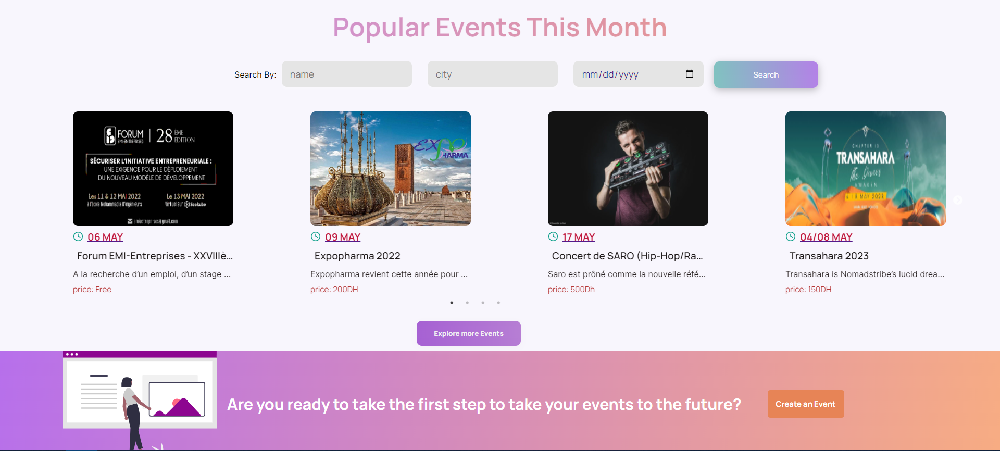
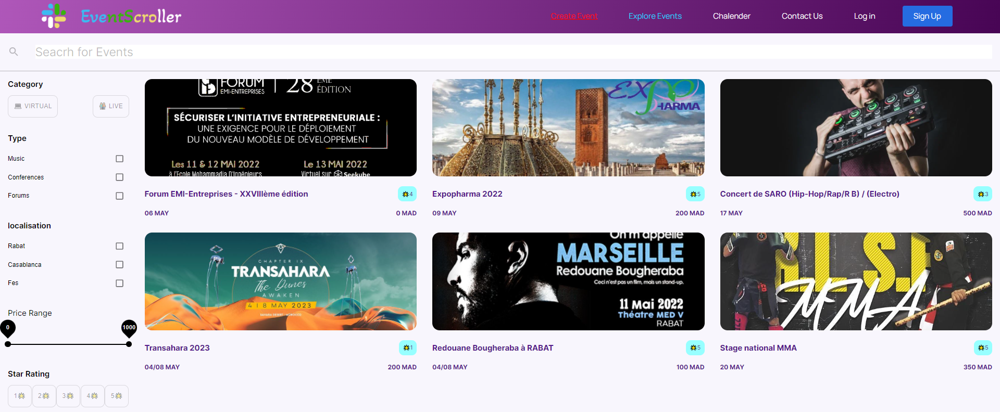
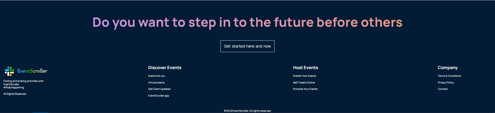

<div id="top"></div>


<!-- PROJECT LOGO -->
<br />
<div align="center">
  <a href="https://github.com/OssamaLouati/EventScroller-PFA">
    
  </a>

  <h3 align="center">EventScroller</h3>

  <p align="center">
    A simple web solution for sharing and finding activities
    <br />
    <a href="https://github.com/OssamaLouati/EventScroller-PFA"><strong>Explore the docs »</strong></a>
    <br />
    <br />
    <a href="https://github.com/OssamaLouati/EventScroller-PFA/issues">Report Bug</a>
    ·
    <a href="https://github.com/OssamaLouati/EventScroller-PFA/issues">Request Feature</a>
  </p>
</div>


<!-- TABLE OF CONTENTS -->
<details>
  <summary>Table of Contents</summary>
  <ol>
    <li>
      <a href="#about-the-project">About The Project</a>
      <ul>
        <li><a href="#built-with">Built With</a></li>
      </ul>
    </li>
    <li>
      <a href="#getting-started">Getting Started</a>
      <ul>
        <li><a href="#prerequisites">Prerequisites</a></li>
        <li><a href="#installation">Installation</a></li>
      </ul>
    </li>
  </ol>
</details>


<!-- ABOUT THE PROJECT -->
## About The Project

<div align="center">
  <a href="https://github.com/OssamaLouati/EventScroller-PFA">
    
    
    
    
  </a>
</div>  
<br>
<br>
EventScroller is a web application that allows its users to meet new people, learn new things, find help, get out of their comfort zone and pursue their passions together.

<p align="right">(<a href="#top">back to top</a>)</p>


### Built With

EventScroller has been built with the following technologies:

* [Node.js](https://nodejs.org/)
* [React.js](https://reactjs.org/)
* [Xammp](https://www.apachefriends.org/fr/index.html)
* [Bootstrap](https://getbootstrap.com)
* [Embedded-javascript](https://ejs.co/)
* [JQuery](https://jquery.com)

<p align="right">(<a href="#top">back to top</a>)</p>


<!-- GETTING STARTED -->
## Getting Started

### Prerequisites

You need first to install the modules using npm command:
* npm
  ```sh
  cd client
  npm install
  ```
  ```sh
  cd server
  npm install
  ```
  

### Installation


1. Clone the repo
   ```sh
   git clone https://github.com/OssamaLouati/EventScroller-PFA.git
   ```
2. Install NPM packages
   ```sh
   npm install
   ```
4. Run the local server in `Terminal`
   ```cmd
   cd client
   npm start
   ```
   ```cmd
   cd server
   nodemon server
   ```

<p align="right">(<a href="#top">back to top</a>)</p>


<!-- CONTACT -->
## Contact

Oussama Louati - louati.oussama@ine.inpt.ma

Project Link: [https://github.com/OssamaLouati/EventScroller-PFAT](https://github.com/OssamaLouati/EventScroller-PFA)

<p align="right">(<a href="#top">back to top</a>)</p>

